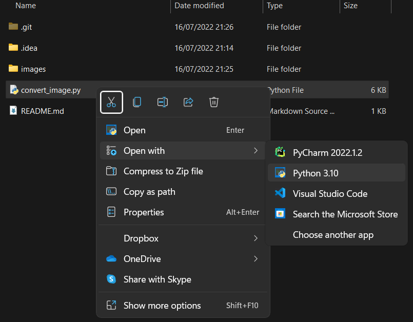
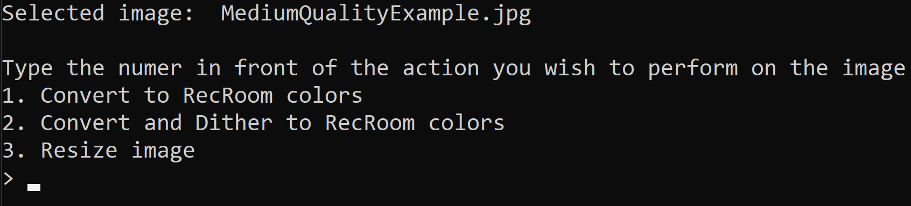

# RecRoom Image Dithering
Convert and/or dither any image into the RecRoom color palette.\
You can also resize the image.

## How to use it

1. Run the file named `convert_image.py` using python (should be the default option)

   
2. A file explorer window will open. Choose the image you want to modify (JPG or PNG)

3. You will be prompted by 3 options:
    * **Convert to RecRoom colors**\
        *This will only convert the image into RecRoom colors **without** dithering.*
    * **Convert and Dither to RecRoom colors**\
        *This will convert and **dither** the image. This makes the image look a lot better*
    * **Resize image**\
        *If the image is too big, you can quickly resize it using 4 different methods*\

Just enter the number in front of the option you'd like to use, and press enter. 

